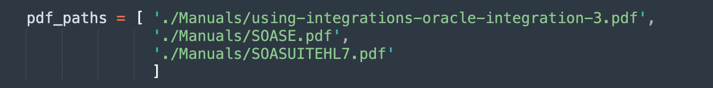
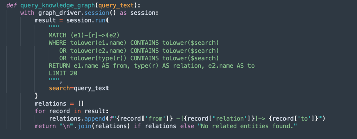
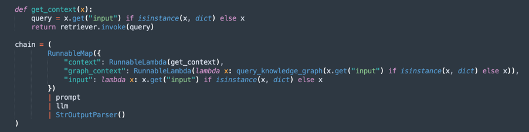

# Analyze PDF Documents in Natural Language with OCI Generative AI

## Introduction

Oracle Cloud Infrastructure Generative AI (OCI Generative AI) is an advanced generative artificial intelligence solution that enables companies and developers to create intelligent applications using cutting-edge language models. Based on powerful technologies such as Large Language Models (LLMs), this solution allows the automation of complex tasks, making processes faster, more efficient, and accessible through natural language interactions.

One of the most impactful applications of OCI Generative AI is in PDF document analysis. Companies frequently deal with large volumes of documents, such as contracts, financial reports, technical manuals, and research papers. Manually searching for information in these files can be time-consuming and prone to errors.

With the use of generative artificial intelligence, it is possible to extract information instantly and accurately, allowing users to query complex documents simply by formulating questions in natural language. This means that instead of reading entire pages to find a specific clause in a contract or a relevant data point in a report, users can just ask the model, which quickly returns the answer based on the analyzed content.

Beyond information retrieval, OCI Generative AI can also be used to summarize lengthy documents, compare content, classify information, and even generate strategic insights. These capabilities make the technology essential for various fields, such as legal, finance, healthcare, and engineering, optimizing decision-making and increasing productivity.

By integrating this technology with tools such as Oracle AI services, OCI Data Science, and APIs for document processing, companies can build intelligent solutions that completely transform the way they interact with their data, making information retrieval faster and more effective.

### Prerequisites

- Install Python `version 3.10` or higher and Oracle Cloud Infrastructure Command Line Interface (OCI CLI).

## Task 1: Install Python Packages

The Python code requires certain libraries for using OCI Generative AI. Run the following command to install the required Python packages.

```
pip install -r requirements.txt
```

## Task 2: Understand the Python Code

This is a demo of OCI Generative AI for querying functionalities of Oracle SOA Suite and Oracle Integration. Both tools are currently used for hybrid integration strategies which means they operate in both cloud and on-premises environments.

Since these tools share functionalities and processes, this code helps in understanding how to implement the same integration approach in each tool. Additionally, it allows users to explore common characteristics and differences.

Download the Python code from here: 

- [`requirements.txt`](./files/requirements.txt)
- [`oci_genai_llm_context.py`](./files/oci_genai_llm_context.py)
- [`oci_genai_llm_context_fast.py`](./files/oci_genai_llm_context_fast.py)
- [`oci_genai_llm_graphrag.py`](./files/oci_genai_llm_graphrag.py)

You can find the PDF documents here:

- [`SOASE.pdf`](https://docs.oracle.com/middleware/12211/soasuite/develop/SOASE.pdf)
- [`SOASUITEHL7.pdf`](https://docs.oracle.com/en/learn/oci-genai-pdf/files/SOASUITEHL7.pdf)
- [`using-integrations-oracle-integration-3.pdf`](https://docs.oracle.com/en/cloud/paas/application-integration/integrations-user/using-integrations-oracle-integration-3.pdf)

Create a folder named `Manuals` and move these PDFs there.

- **Import Libraries:**

  Imports the necessary libraries for processing PDFs, OCI Generative AI, text vectorization, and storage in vector databases (Facebook AI Similarity Search (FAISS) and ChromaDB).

  - `UnstructuredPDFLoader` is used to extract text from PDFs.

  - `ChatOCIGenAI` enables the use of OCI Generative AI models to answer questions.

  - `OCIGenAIEmbeddings` creates embeddings (vector representations) of text for semantic search.

    

- **Load and Process PDFs:**

  Lists the PDF files to be processed.

  - `UnstructuredPDFLoader` reads each document and splits it into pages for easier indexing and searching.

  - Document IDs are stored for future reference.

  

- **Configure the OCI Generative AI Model:**

  Configures the `Llama-3.1-405b` model hosted on OCI to generate responses based on the loaded documents.

  Defines parameters such as `temperature` (randomness control), `top_p` (diversity control), and `max_tokens` (token limit).

  

  > **Note:** The available LLaMA version may change over time. Please check the current version in your tenancy and update your code if needed.

- **Create Embeddings and Vector Indexing:**

  Uses Oracle's embedding model to transform text into numerical vectors, facilitating semantic searches in documents.

  

  - FAISS stores the embeddings of the PDF documents for quick queries.

  - `retriever` allows retrieving the most relevant excerpts based on the semantic similarity of the user's query.

  


- In the first processing execution, the vector data will be saved on a FAISS database.

  

- **Define the Prompt:**

  Creates an intelligent prompt for the generative model, guiding it to consider only relevant documents for each query.

  This improves the accuracy of responses and avoids unnecessary information.

  

- **Create the Processing Chain (RAG - Retrieval-Augmented Generation):**

  Implements a RAG flow, where:

  - `retriever` searches for the most relevant document excerpts.
  - `prompt` organizes the query for better context.
  - `llm` generates a response based on the retrieved documents.
  - `StrOutputParser` formats the final output.

  


- **Question and Answer Loop:**

  Maintains a loop where users can ask questions about the loaded documents.

  - The AI responds using the knowledge base extracted from the PDFs.

  - If you enter `quit`, it exits the program.

  


### Fixed Size Chunking

**(A Faster Alternative: Fixed-Size Chunking)**

Fixed-Size Chunking is a simple and efficient text-splitting strategy where documents are divided into chunks based on predefined size limits, typically measured in tokens, characters, or lines.

This method does not analyze the meaning or structure of the text. It simply slices the content at fixed intervals, regardless of whether the cut happens in the middle of a sentence, paragraph, or idea.

How Fixed-Size Chunking Works:

•	Example Rule:

    Split the document every 1000 tokens (or every 3000 characters).

•	Optional Overlap:

    To reduce the risk of splitting relevant context, 
    some implementations add an overlap between consecutive chunks (e.g., 200-token overlap)
    to ensure that important context isn’t lost at the boundary.

**Benefits of Fixed-Size Chunking:**

- **Fast processing:**
No need for semantic analysis, LLM inference, or content understanding. Just count and cut.

- **Low resource consumption:**
Minimal CPU/GPU and memory usage, making it scalable for large datasets.

- **Easy to implement:**
Works with simple scripts or standard text processing libraries.

**Limitations of Fixed-Size Chunking:**

- **Poor semantic awareness:**
Chunks may cut off sentences, paragraphs, or logical sections, leading to incomplete or fragmented ideas.

- **Reduced retrieval precision:**
In applications like semantic search or Retrieval-Augmented Generation (RAG), poor chunk boundaries can affect the relevance and quality of retrieved answers.

**When to Use Fixed-Size Chunking:**

- When processing speed and scalability are top priorities.

- For large-scale document ingestion pipelines where semantic precision is not critical.

- As a first step in scenarios where later refinement or semantic analysis will happen downstream.


- This is a very simple method to split text:

  

- And this is the main process of fixed chunking:

  

  >**Note:** Download this code to process the **fixed chunking** more **faster**: [`oci_genai_llm_context_fast.py`](./files/oci_genai_llm_context_fast.py) 

### Semantic Chunking

**What is Semantic Chunking?**

Semantic Chunking is a text pre-processing technique where large documents (such as PDFs, presentations, or articles) are split into smaller parts called “chunks”, with each chunk representing a semantically coherent block of text.

Unlike traditional fixed-size chunking (e.g., splitting every 1000 tokens or every X characters), Semantic Chunking uses Artificial Intelligence (typically Large Language Models - LLMs) to detect natural content boundaries, respecting topics, sections, and context.

Instead of cutting text arbitrarily, Semantic Chunking tries to preserve the full meaning of each section, creating standalone, context-aware pieces.

**Why Can Semantic Chunking Make Processing Slower?**

A traditional chunking process, based on fixed size, is fast: the system just counts tokens or characters and cuts accordingly.

With Semantic Chunking, several extra steps of semantic analysis are required:

1.	Reading and interpreting the full text (or large blocks) before splitting:
      The LLM needs to “understand” the content to identify the best chunk boundaries.
2.	Running LLM prompts or topic classification models:
      The system often queries the LLM with questions like:
      “Is this the end of an idea?” or “Does this paragraph start a new section?”
3.	Higher memory and CPU/GPU usage:
      Because the model processes larger text blocks before making chunking decisions, resource consumption is significantly higher.
4.	Sequential and incremental decision-making:
      Semantic chunking often works in steps (e.g., analyzing 10,000-token blocks and then refining chunk boundaries inside that block), which increases total processing time.

>**Note:** 
> - Depending on your machine processing power, you will wait a long, long time to finalize the first execution using **Semantic Chunking**.
> - You can use this algorithm to produce customized chunking using **OCI Generative AI**.

- This is the main document process. It uses:

  - **`smart_split_text()`:** Separates the full-text in small pieces of 10kb (you can configure to adopt other strategies). The mechanism perceive the last paragraph. If part of the paragraph is in the next text piece, this part will be ignored in the processing and will be appended on the next processing text group.
  - **`semantic_chunk()`:** This method will use the OCI LLM mechanism to separate the paragraphs. It includes the intelligence to identify the titles, components of a table, the paragraphs to execute a smart chunk. The strategy here is to use the **Semantic Chunk** technique. It will took more time to complete the mission if compared with the common processing. So, the first processing will took a long time but the next will load all the FAISS pre-saved data.
  - **`split_llm_output_into_chapters()`:** This method will finalize the chunk, separating the chapters.
    
    

  >**Note:** Download this code to process the **semantic chunking**: [`oci_genai_llm_context.py`](./files/oci_genai_llm_context.py)

### Combining Semantic Chunking with GraphRAG

**GraphRAG (Graph-Augmented Retrieval-Augmented Generation)** is an advanced AI architecture that combines traditional vector-based retrieval with structured knowledge graphs. In a standard RAG pipeline, a language model retrieves relevant document chunks using semantic similarity from a vector database (like FAISS). However, vector-based retrieval operates in an unstructured manner, relying purely on embeddings and distance metrics, which sometimes miss deeper contextual or relational meanings.

**GraphRAG** enhances this process by introducing a knowledge graph layer, where entities, concepts, components, and their relationships are explicitly represented as nodes and edges. This graph-based context enables the language model to reason over relationships, hierarchies, and dependencies that vector similarity alone cannot capture.

### Why Combine Semantic Chunking with GraphRAG?

Semantic chunking is the process of intelligently splitting large documents into meaningful units or “chunks,” based on the content’s structure — such as chapters, headings, sections, or logical divisions. Rather than breaking documents purely by character limits or naive paragraph splitting, semantic chunking produces higher-quality, context-aware chunks that align better with human understanding.

When combined with GraphRAG, semantic chunking offers several powerful advantages:

  1.	Enhanced Knowledge Representation:

   - Semantic chunks preserve logical boundaries in the content.
   - Knowledge graphs extracted from these chunks maintain accurate relationships between entities, systems, APIs, processes, or services.

   2.	Multi-Modal Contextual Retrieval (the language model retrieves both):

   - Unstructured context from the vector database (semantic similarity).
   - Structured context from the knowledge graph (entity-relation triples).
   - This hybrid approach leads to more complete and accurate answers.

   3.	Improved Reasoning Capabilities:

   - Graph-based retrieval enables relational reasoning.
   - The LLM can answer questions like:

> “What services does the Order API depend on?” 

> “Which components are part of the SOA Suite?”
   - These relational queries are often impossible with embedding-only approaches.

   4.	Higher Explainability and Traceability:

   - Graph relationships are human-readable and transparent.
   - Users can inspect how answers are derived from both textual and structural knowledge.

   5.	Reduced Hallucination:

- The graph acts as a constraint on the LLM, anchoring responses to verified relationships and factual connections extracted from the source documents.


   6.	Scalability Across Complex Domains:

   - In technical domains (e.g., APIs, microservices, legal contracts, healthcare standards), relationships between components are as important as the components themselves.
   - GraphRAG combined with semantic chunking scales effectively in these contexts, preserving both textual depth and relational structure.

>**Note 1:** Download this code to process the **semantic chunking** with **graphRAG**: [`oci_genai_llm_graphrag.py`](./files/oci_genai_llm_graphrag.py)

>**Note 2:** You will need:
> 
> - A docker installed and active to use the **Neo4J** open-source graphos database to test
> - Install **neo4j** Python Library

There are 2 methods:

### create_knowledge_graph 

- This method automatically extracts entities and relationships from text chunks and stores them in a Neo4j knowledge graph. 
- For each document chunk, it sends the content to a LLM (Large Language Model) with a prompt asking to extract entities (like systems, components, services, APIs) and their relationships. 
- It parses each line, extracts Entity1, RELATION, and Entity2.
- Stores this information as nodes and edges in the Neo4j graph database using Cypher queries:


    MERGE (e1:Entity {name: $entity1})
    MERGE (e2:Entity {name: $entity2})
    MERGE (e1)-[:RELATION {source: $source}]->(e2)


### query_knowledge_graph 

- This method queries the Neo4j knowledge graph to retrieve relationships related to a specific keyword or concept.
- Executes a Cypher query that searches for:


    Any relationship (e1)-[r]->(e2)
    Where e1.name, e2.name, or the relationship type contains the query_text (case-insensitive).


- Returns up to 20 matching triples formatted as:


    Entity1 -[RELATION]-> Entity2






>**Disclaimer: Neo4j Usage Notice**
> 
> This implementation uses Neo4j as an embedded knowledge graph database for demonstration and prototyping purposes. While Neo4j is a powerful and flexible graph database suitable for development, testing, and small to medium workloads, it may not meet the requirements for enterprise-grade, mission-critical, or highly secure workloads, especially in environments that demand high availability, scalability, and advanced security compliance.
> 
> For production environments and enterprise scenarios, we recommend leveraging **Oracle Database** with **Graph** capabilities, which offers:
>
>     Enterprise-grade reliability and security.
> 
>     Scalability for mission-critical workloads. 
> 
>     Native graph models (Property Graph and RDF) integrated with relational data. 
> 
>     Advanced analytics, security, high availability, and disaster recovery features. 
> 
>     Full Oracle Cloud Infrastructure (OCI) integration.
> 
> By using Oracle Database for graph workloads, organizations can unify structured, semi-structured, and graph data within a single, secure, and scalable enterprise platform.


## Task 3: Run Query for Oracle Integration and Oracle SOA Suite Contents

Run the following command.

```
FOR FIXED CHUNKING TECHNIQUE (MORE FASTER METHOD)
python oci_genai_llm_context_fast.py --device="mps" --gpu_name="M2Max GPU 32 Cores"
```

```
FOR SEMANTIC CHUNKING TECHNIQUE
python oci_genai_llm_context.py --device="mps" --gpu_name="M2Max GPU 32 Cores"
```

```
FOR SEMANTIC CHUNKING COMBINED WITH GRAPHRAG TECHNIQUE
python oci_genai_llm_graphrag.py --device="mps" --gpu_name="M2Max GPU 32 Cores"
```


> **Note:** The `--device` and `--gpu_name` parameters can be used to accelerate the processing in Python, using GPU if your machine has one. Consider that this code can be used with local models too.

The provided context distinguishes Oracle SOA Suite and Oracle Integration, you can test the code considering these points:

- The query should be made only for Oracle SOA Suite: Therefore, only Oracle SOA Suite documents should be considered.
- The query should be made only for Oracle Integration: Therefore, only Oracle Integration documents should be considered.
- The query requires a comparison between Oracle SOA Suite and Oracle Integration: Therefore, all documents should be considered.

We can define the following context, which greatly helps in interpreting the documents correctly.


The following image shows the example of comparison between Oracle SOA Suite and Oracle Integration.


## Next Steps

This code demonstrates an application of OCI Generative AI for intelligent PDF analysis. It enables users to efficiently query large volumes of documents using semantic searches and a generative AI model to generate accurate natural language responses.

This approach can be applied in various fields, such as legal, compliance, technical support, and academic research, making information retrieval much faster and smarter.

## Related Links

- [Extending SaaS by AI/ML features - Part 8: OCI Generative AI Integration with LangChain Use Cases](https://www.ateam-oracle.com/post/oci-generative-ai-integration-with-langchain-usecases)

- [Bridging cloud and conversational AI: LangChain and OCI Data Science platform](https://blogs.oracle.com/ai-and-datascience/post/cloud-conversational-ai-langchain-oci-data-science)

- [Install OCI CLI](https://docs.oracle.com/en-us/iaas/Content/API/SDKDocs/cliinstall.htm#Quickstart)

- [Introduction to Custom and Built-in Python LangChain Agents](https://wellsr.com/python/working-with-python-langchain-agents/)

- [Oracle Database Insider - Graph RAG: Bring the Power of Graphs to Generative AI](https://blogs.oracle.com/database/post/graph-rag-bring-the-power-of-graphs-to-generative-ai)

## Acknowledgments

- **Author** - Cristiano Hoshikawa (Oracle LAD A-Team Solution Engineer)
