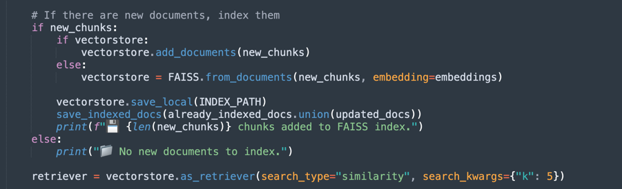
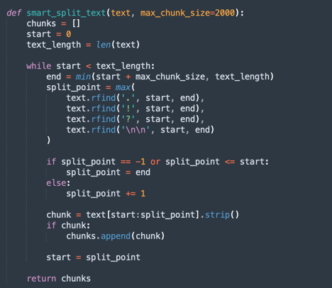
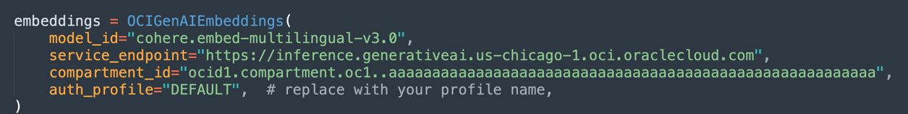

# Consult PDF Documents in Natural Language with OCI Generative AI

## Introduction

Oracle Cloud Generative AI is an advanced generative artificial intelligence solution that enables companies and developers to create intelligent applications using cutting-edge language models. Based on powerful technologies such as LLMs (Large Language Models), this solution allows the automation of complex tasks, making processes faster, more efficient, and accessible through natural language interactions.

One of the most impactful applications of Oracle Cloud Generative AI is in PDF document analysis. Companies frequently deal with large volumes of documents, such as contracts, financial reports, technical manuals, and research papers. Manually searching for information in these files can be time-consuming and prone to errors.

With the use of generative artificial intelligence, it is possible to extract information instantly and accurately, allowing users to query complex documents simply by formulating questions in natural language. This means that instead of reading entire pages to find a specific clause in a contract or a relevant data point in a report, users can just ask the model, which quickly returns the answer based on the analyzed content.

Beyond information retrieval, Oracle Cloud Generative AI can also be used to summarize lengthy documents, compare content, classify information, and even generate strategic insights. These capabilities make the technology essential for various fields, such as legal, finance, healthcare, and engineering, optimizing decision-making and increasing productivity.

By integrating this technology with tools such as Oracle AI Services, OCI Data Science, and APIs for document processing, companies can build intelligent solutions that completely transform the way they interact with their data, making information retrieval faster and more effective.

### Prerequisites

To use the demo, you need to have the following pre-installed:

- Python 3.10 or higher
- OCI CLI

### Install Python Packages

The Python code requires certain libraries for using OCI Generative AI. Install the required Python packages by running:

    pip install -r requirements.txt

## Understand the Code

This a demo of OCI Generative AI for querying functionalities of Oracle SOA SUITE and Oracle Integration.

Both tools are currently used for hybrid integration strategies, meaning they operate in both Cloud and on-prem environments.

Since these tools share functionalities and processes, this code helps in understanding how to implement the same integration approach in each. Additionally, it allows users to explore common characteristics and differences.

You can find the Python codes at:

- [requirements.txt](source/requirements.txt)
- [oci_genai_llm_context.py](source/oci_genai_llm_context.py)

Below, we will explain each section of the code.

### Import Libraries

Imports the necessary libraries for processing PDFs, Oracle generative AI, text vectorization, and storage in vector databases (FAISS and Chroma).

• PyPDFLoader is used to extract text from PDFs.

• ChatOCIGenAI enables the use of Oracle Cloud Generative AI models to answer questions.

• OCIGenAIEmbeddings creates embeddings (vector representations) of texts for semantic search.

### Load and Process PDFs

Lists the PDF files to be processed.

• PyPDFLoader reads each document and splits it into pages for easier indexing and searching.

• Document IDs are stored for future reference.

### Configure the Oracle Generative Model

Configures the Llama-3.1-405b model hosted on Oracle Cloud to generate responses based on the loaded documents.

• Defines parameters such as temperature (randomness control), top_p (diversity control), and token limit.

>**Note:** Please, confirm that the version of Llama available to use in your tenancy. Depending on when you are reading this tutorial, you cannot find this model anymore. 

### Create Embeddings and Vector Indexing

Uses Oracle's embedding model to transform texts into numerical vectors, facilitating semantic searches in documents.

• FAISS (Facebook AI Similarity Search) stores the embeddings of the PDF documents for quick queries.

• retriever allows retrieving the most relevant excerpts based on the semantic similarity of the user's query.

### Storage in ChromaDB

ChromaDB is a vector database used to store documents and enable efficient queries.

Here, processed PDFs are stored for future searches.

### Define the Prompt

Creates an intelligent prompt for the generative model, guiding it to consider only relevant documents for each query.

• This improves the accuracy of responses and avoids unnecessary information.

### Create the Processing Chain (RAG - Retrieval-Augmented Generation)

Implements an RAG (Retrieval-Augmented Generation) flow, where:

1. retriever searches for the most relevant document excerpts.
2. prompt organizes the query for better context.
3. llm generates a response based on the retrieved documents.
4. StrOutputParser formats the final output.

### Question and Answer Loop

Maintains a loop where users can ask questions about the loaded documents.

• The AI responds using the knowledge base extracted from the PDFs.

• Typing "quit" exits the program.

## Query for OIC and SOA Suite contents

Run the following command:

    python oci_genai_llm_context.py --device="mps" --gpu_name="M2Max GPU 32 Cores"

>**Note:** the parameters --device and --gpu_name could be used to accelerate the processing in Python, using GPU if your machine have one.  Consider that this code can be used with local models too.

Thanks to the context provided to distinguish between SOA SUITE and Oracle Integration, you can test the code considering this points:

- The query should be made only for SOA SUITE: Therefore, only SOA SUITE documents should be considered.
- The query should be made only for Oracle Integration: Therefore, only Oracle Integration documents should be considered.
- The query requires a comparison between SOA SUITE and Oracle Integration: Therefore, all documents should be considered.

We can define the following context, which greatly helps in interpreting the documents correctly:

Example of comparison between SOA SUITE and Oracle Integration:

Example regarding Kafka:

## Conclusion

This code demonstrates an application of Oracle Cloud Generative AI for intelligent PDF analysis. It enables users to efficiently query large volumes of documents using semantic searches and a generative AI model to generate accurate natural language responses.

This approach can be applied in various fields, such as legal, compliance, technical support, and academic research, making information retrieval much faster and smarter.

## References

- [Extending SaaS by AI/ML features - Part 8: OCI Generative AI Integration with LangChain Use Cases](https://www.ateam-oracle.com/post/oci-generative-ai-integration-with-langchain-usecases)
- [Bridging cloud and conversational AI: LangChain and OCI Data Science platform](https://blogs.oracle.com/ai-and-datascience/post/cloud-conversational-ai-langchain-oci-data-science)
- [Install OCI CLI](https://docs.oracle.com/en-us/iaas/Content/API/SDKDocs/cliinstall.htm#Quickstart)
- [Introduction to Custom and Built-in Python LangChain Agents](https://wellsr.com/python/working-with-python-langchain-agents/)

## Acknowledgments

- **Author** - Cristiano Hoshikawa (Oracle LAD A-Team Solution Engineer)

